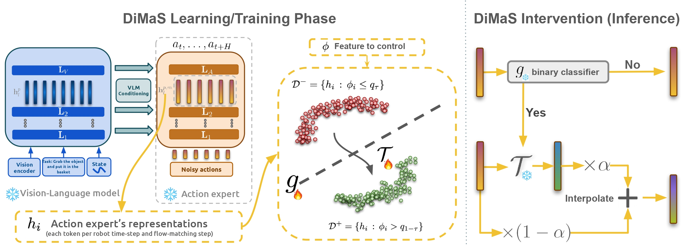
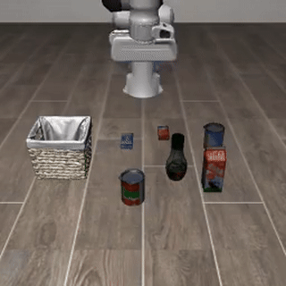
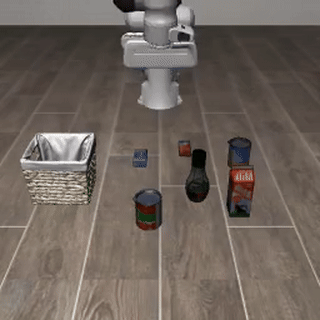
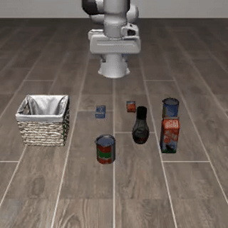

# *DiMaS*: *Di*stribution *Ma*tching for *S*teering Vision-Language-Action Models

## Abstract

Flow-matching-based vision-language-action (VLA) models have emerged as powerful policies for robotic manipulation, yet a critical capability remains underexplored: fine-grained behavioral control, the ability to govern how a robot performs a task by intervening on its internal representations. Representation steering is a well-established interpretability tool for language and vision-language models, where behavioral features are typically encoded as linear directions, but we show that these classic methods fall short in VLAs. We propose *DiMaS*, a *Di*stribution *Ma*tching *S*teerubf strategy tailored to flow-matching VLAs, which transports between representation distributions rather than shifting along a fixed direction, and show that it effectively controls behavior across two state-of-the-art VLAs.


<br> <br>
<p align="center">
  
</p>


## Demos

<!-- TODO: swap the GIFs below for real rollouts once generated, see
     scripts/examples/steering/{speed,z-displacement}/SmolVLA/02_apply_steering.sh.
     Suggested conversion (short clip, small + smooth):
       ffmpeg -i steered.mp4 -vf "fps=15,scale=320:-1:flags=lanczos,palettegen" palette.png
       ffmpeg -i steered.mp4 -i palette.png -filter_complex \
         "fps=15,scale=320:-1:flags=lanczos[x];[x][1:v]paletteuse" out.gif -->

### Speed steering high → low

<p align="center">
  <table>
    <tr>
      <th align="center">Baseline (unsteered)</th>
      <th align="center">Steered (high → low)</th>
    </tr>
    <tr>
      <td align="center"></td>
      <td align="center"></td>
    </tr>
  </table>
</p>

The end-effector moves noticeably slower after steering.

### Height steering low → high

<p align="center">
  <table>
    <tr>
      <th align="center">Baseline (unsteered)</th>
      <th align="center">Steered (low → high)</th>
    </tr>
    <tr>
      <td align="center"></td>
      <td align="center"></td>
    </tr>
  </table>
</p>

The end-effector moves higher (larger `|Δz|` per step) after steering.

<!-- Both come from `scripts/examples/steering/` (see [Examples](#examples) below to reproduce them yourself). -->


## Installation

### Environment

1. Install `xl_vlas` itself, from the repo root:

   ```bash
   pip install -e .
   ```

2. Install **`lerobot`, version `0.5.0`**.

   Follow the official installation guide: https://huggingface.co/docs/lerobot/installation
   The package versions pinned by `lerobot` should work correctly.

3. Install **LIBERO** separately, then make sure Python can find it. Open
   `src/lerobot/envs/libero.py` (inside your `lerobot` install) and add at
   the top of the file:

   ```python
   import sys
   sys.path.append("/path/to/LIBERO")
   ```

   > ⚠️ **Required for extraction/steering to work.** xl-vlas patches two
   > `lerobot` files to expose the hook points used throughout this repo
   > (`model.vlm_with_expert.layer_hooks.{0,1}.*`, see `scripts/examples/`).
   > Copy both files from
   > [`src/xl_vlas/lerobot_changes/`](src/xl_vlas/lerobot_changes/) over the
   > matching files in your `lerobot` install:
   >
   > | File in `lerobot_changes/` | Target in your `lerobot` install |
   > |---|---|
   > | `libero.py` | `src/lerobot/envs/libero.py`|
   > | `smolvlm_with_expert.py` | `src/lerobot/policies/smolvla/smolvlm_with_expert.py` |
   >
   > Without this, `layer_hooks` doesn't exist on the model and every
   > `--modules_to_hook` / `--hook_names` flag in `scripts/examples/` will
   > silently attach to nothing.

4. LIBERO rendering requires a GPU and headless EGL rendering:

   ```bash
   export MUJOCO_GL=egl
   ```

### Datasets

No separate dataset download is needed, all experiments run on the
[LIBERO](https://github.com/Lifelong-Robot-Learning/LIBERO) simulation
benchmark (task suites such as `libero_object`, `libero_spatial`,
`libero_goal`), which is installed as part of the Environment setup above.
<!-- LIBERO ships its own task definitions and initial states; xl-vlas only
consumes them through the `lerobot` LIBERO environment wrapper. -->

### Models

xl-vlas steers pretrained VLA policies. The
checkpoints are pulled automatically from the Hugging Face Hub the first
time you run a script (set `HF_HOME` to control the cache location):

| Policy | Hugging Face Hub id |
|---|---|
| SmolVLA | [`HuggingFaceVLA/smolvla_libero`](https://huggingface.co/HuggingFaceVLA/smolvla_libero) |
| PI-0.5 | [`lerobot/pi05-libero`](https://huggingface.co/lerobot/pi05-libero) |

Pass the checkpoint via `--policy.path=<hub-id-or-local-path>` to
`src/xl_vlas/save_features.py` (see `scripts/examples/` below).

## Main Experiments

The scripts that produced the full sweep of results in the paper are not
part of this public release. To reproduce the *method* end to end
extraction, steering-vector training, and steered inference see the
[Examples](#examples) section below, which walks through the same pipeline
on a smaller scale (`libero_object`, 10 episodes/task) that runs on a single
GPU.


## Examples

<!-- The scripts under [`scripts/examples/`](scripts/examples/) walk through the full xl-vlas
pipeline end to end: extract hidden representations from policy rollouts,
train a steering vector from them, then apply that vector at inference time
to see the robot's behavior change. -->

<!-- ### Prerequisites

- A Python environment with `lerobot` and `xl_vlas` installed (`pip install -e .`
  from the repo root, plus lerobot on your `PYTHONPATH` or installed), see
  Installation above.
- A GPU. LIBERO rendering requires `MUJOCO_GL=egl`, which needs a GPU driver,
  there is currently no CPU-only path.
- The policy checkpoints are pulled automatically from the Hugging Face Hub
  the first time you run a script (`HuggingFaceVLA/smolvla_libero` or
  `lerobot/pi05-libero`). Set `HF_HOME` if you want them cached somewhere
  specific.

Every script reads its paths from environment variables with sensible
defaults (see the top of each file), so you can override e.g. `OUTPUT_DIR`
or `POLICY_PATH` without editing the script:

```bash
OUTPUT_DIR=/my/output/dir bash scripts/examples/extraction/SmolVLA/VLM/extract_baseline.sh
``` -->

### Steering targets

- **speed** : steers the robot's end-effector to move faster/slower.
- **z-displacement** : steers the robot's end-effector to move more or less vertically.

Both use the exact same underlying mechanism (mapping between a
"low" and "high" activation cluster), only the quantity used to define
"low" vs "high" differs, so the two pipelines are structurally identical.

### Pipeline

```
extraction/{SmolVLA,PI_0.5}/{FM,VLM}/extract_baseline.sh
        │
        │  Extracts and saves hidden states representations for
        │  (VLM = vision-language backbone,FM = flow-matching / action-expert layers)
        │
        ▼
steering/{speed,z-displacement}/{SmolVLA,PI_0.5}/01_train_steering_vector.sh
        │
        │  reads the saved representations, and trains DiMas map between the two designed groups
        │
        │
        ▼
steering/{speed,z-displacement}/{SmolVLA,PI_0.5}/02_apply_steering.sh
        │
        │  runs rollouts on held-out tasks, this time injecting the
        │  steering vector into the model's activations at inference time
        ▼
```

<!-- `01_train_steering_vector.sh` consumes the **FM** extraction (it trains on
the flow-matching/action-expert layers, layer group `1`). The **VLM**
extraction (layer group `0`) is included as a standalone example of the
other family of methods available in `scripts/features/speed.py` and
`z_displacement.py` — `train-regression-vlm-clf` and
`train-diff-means-vlm-clf` — which are mentioned as alternatives in the
comments of the training scripts but not wired into `02_apply_steering.sh`
by default (Optimal Transport is the flagship method showcased here). -->


## Citations

If you use this code, please cite:

```bibtex
@misc{dimas2026,
  title         = {{DiMaS}: Distribution Matching for Steering Vision-Language-Action Models},
  author        = {Khayatan*, Pegah and Meziane*, Sara and Parekh*, Jayneel and Cord, Matthieu},
  year          = {2026},
  eprint        = {2607.14280},
  archivePrefix = {arXiv},
  primaryClass  = {cs.CV},
  url           = {https://arxiv.org/abs/2607.14280},
  note          = {*Equal contribution.},
}
```
